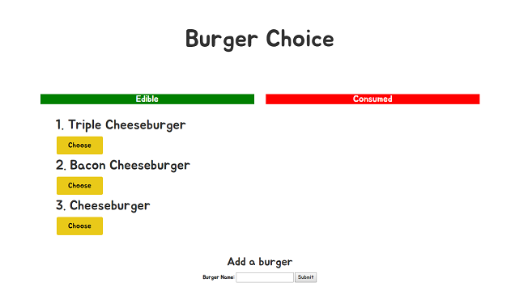
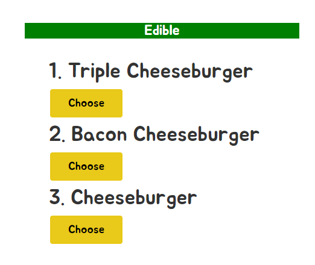
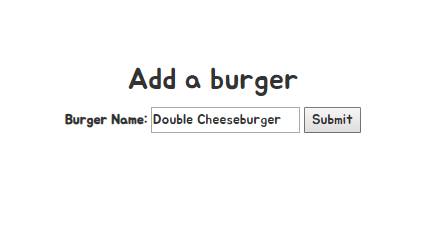
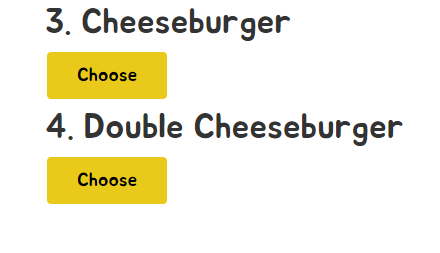
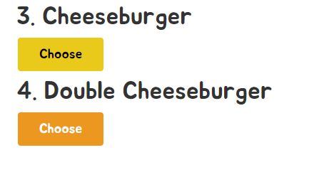
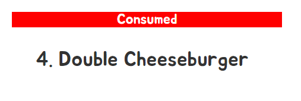
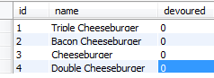
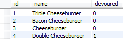

## Burger Choice App

<a href="#">**Live Demo**</a> hosted on <a href="https://heroku.com/">Heroku</a>
<br/>
_Currently offline_

### Objectives
1. Create an app that allows users to see a variety of Burgers to choose from
2. Allow the user to add a Burger if they do not see one they like
3. Once a decision has been made, allow the user to choose, moving the burger to the 'Consumed' category

### Installation
The user must:
1. Perform a <a href="https://help.github.com/articles/fetching-a-remote/#clone">git clone</a> to get the files on their machine. 
2. Install Node, MySQL and <a href="https://www.mamp.info/en/">MAMP</a>
4. Take the necessary steps to get the server and database up and running in MySQL
<br/>
*Please refer to the <a href="https://github.com/justinvert/Burger-Choice#resources-used">respective documentation</a> for proper installation procedures*
<br/>
<br/>

After the above mentioned items have been installed and are working properly, the user must then navigate to where the repository is stored locally and run the command:
```
npm install

```
Upon running this, it will install multiple dependencies required for the app to work properly.
With those installed, the user can then connect to the app through the command:
```
node server.js

```
The application can be viewed at:
```
http://localhost:3000/

```

### Functionality
The app displays two columns, with a submit feature at the very bottom of the page.

<br/>

The user is given the current items in the database, with the option to choose them.

<br/>

If they don't like the items they currently see, they are given the option to add one.

<br/>

<br/>

When chosen, the item is then moved to the right column, as it is no longer active.

<br/>

<br/>

In the database itself, the 'devoured' value that was once 'false' changes to 'true'.
<br/>

<br/>

<br/>

### Resources used

*  <a href="https://www.mysql.com/">MySQL</a> 
*  <a href="https://getbootstrap.com/">Bootstrap</a> 
*  <a href="https://nodejs.org/en/">Node.js</a>
*  <a href="https://expressjs.com/">Express.js</a>
*  <a href="https://handlebarsjs.com/">Handlebars.js</a>
*  <a href="https://fonts.google.com/">Google Fonts</a>
*  <a href="https://www.npmjs.com/package/dotenv">Dotenv Module</a> 
*  <a href="https://www.npmjs.com/package/mysql">MySQL Module</a>
*  <a href="https://www.npmjs.com/package/body-parser">Body Parser Module</a>
*  <a href="https://www.npmjs.com/package/method-override">Method Override Module</a> 
*  <a href="https://www.npmjs.com/package/express-handlebars">Express Handlebars Module</a>
